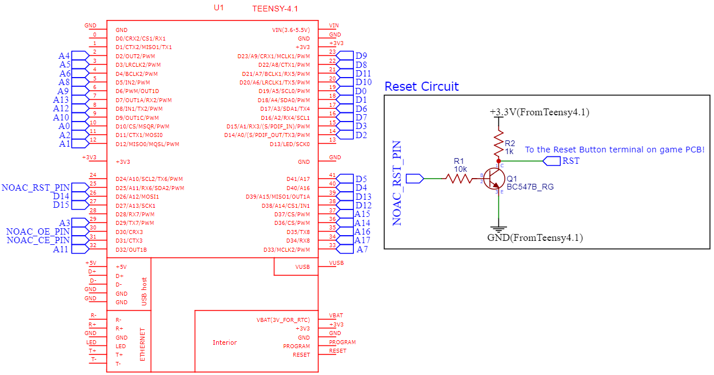
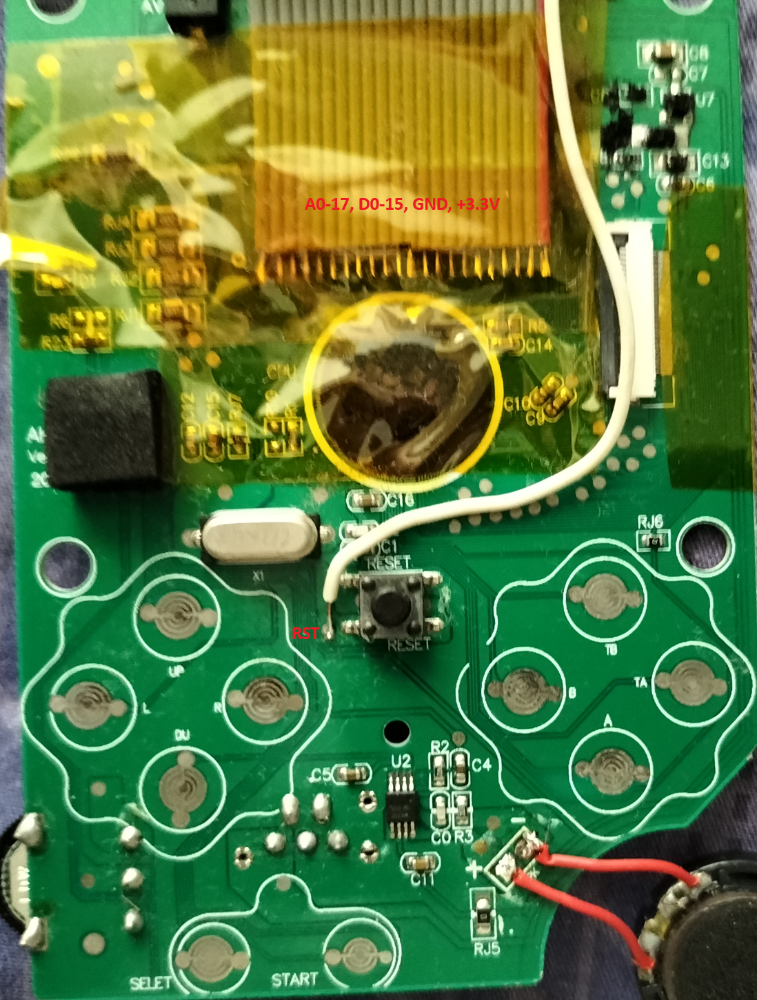
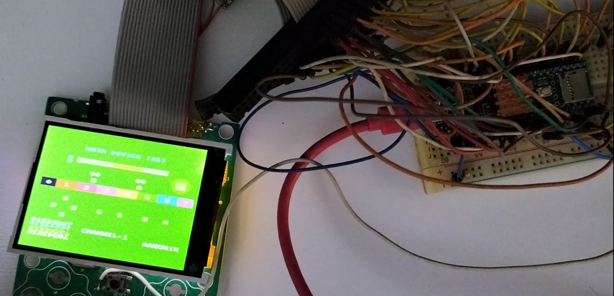

## arduino-teensy41-noac

# Caution: This requires *overclocking* the Teensy 4.1 to at least 912MHz! Use a **heatsink** and **allow good airflow** before attempting this!

**Prototype Flash Emulator**: Connect the Teensy 4.1 to the Famiclone-on-a-Chip (VT-03 and equivalent), especially on the Sup 400-in-1 handhelds. Only the first 128KB is accessible for now.

This works by connecting all the address lines, data lines and control lines to the vacant Flash BGA breakout board.

Usage:
1. Use the "romdumper" or "arduino-rp2040-romdumper" as provided in the folder. Assemble the dumper according to the schematic in that folder and run the Python app.
2. Using a hex editor such as HxD, extract out the 0x60000-0x80000 and put these into the another new binary file.
3. Connect the Teensy 4.1 to the handheld PCB with a 1.27mm pitch ribbon cable and some IDC connectors. The other end of the ribbon cable (not shown here) is connected to the female IDC connector (more than 22 pins). The white cable that is soldered to the Reset button on the PCB is the RST at the schematic. Here is an picture to explain how it is connected:

4. Get a heatsink for the Teensy 4.1! After placing it, build the code and upload it.
5. Use an app such as TeraTerm to allow the file uploads through Ymodem. If you are seeing "C"s printed in the terminal, it is waiting for the user to upload the file.
6. When the file is uploaded, the Teensy will reboot the NOAC on the handheld PCB and you should see the game menu. Obviously, the menu is only accessible and the other games are not because it is not included in the memory. If you have pressed and hold the A and B during the reboot you are going to the green test screen such as in that picture.

## Known issues:
* Use a Kapton tape to secure the soldered cables at the PCB. The lines are **very flimsy** and could tear by just a few slight movements of the cables. 
* This runs at 916MHz. Anything slower would cause the screen to be messed up and garbled and the uploaded binary being unusable. **Please use a heatsink!**
* Due to the arrangement of the Teensy 4.1's pins, it is not really possible to align all the address pins at the same GPIO. The address pins are spread across different GPIOs, and a number of bit manipulation has to be done. This is adding more time to decode the address.
* It can only access up to 128KBytes. It might be good enough for one to write a small 6502 app inside.

## References:
* Flash emulator is loosely based on [this code](https://github.com/gfoot/picoprom/tree/main).
* Ymodem from [Loboris' github](https://github.com/loboris/ESP32_ymodem_example).
* ROM dumping methods are loosely based on Aleksandr Serdyukov's [SUP Console flash programmator](https://github.com/Promolife/sup_console_programmator).