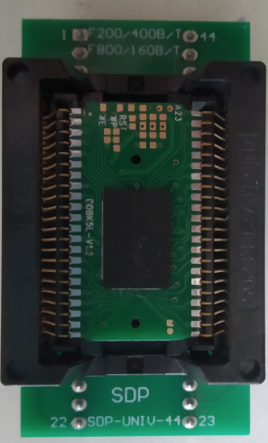

## Raspberry Pico ROM dumper for K5L2731CAM breakout boards on Famiclone handhelds (Sup 400-in-1)

This is a prototype of the ROM dumper using 2 I/O expanders (MCP23017) and a Raspberry Pico. Since it is using Arduino instead of Python, the dumping is significantly faster (about 35 mins on a 16Mbytes dump). 

### Notes:
* Tie the reset pins on the MCP23017 to +3.3V to prevent non-detection and glitching!
* Add pull-ups 4.7K resistors on the I2C lines if you notice data corruption when doing the dump!


The SOP44 to DIP converter:



### Attention: 
* If you cannot fit the extracted breakout board, try slowly filing the four corners and retry fitting.

### Instructions
* Build the romdumper with the SOP44 to DIP converter as seen in the schematic.
* Compile and upload the provided Arduino sketch to the Raspberry Pico.
* Run the Python script. You can adjust the address range (addrStart and addrEnd).


### Result of fully dumped binary at 16Mbytes:
```
================
Dump successful!
================
File written:  romdump_10042024_201812.bin
Start time:  2024-04-10 20:18:12.549339
Stop time:  2024-04-10 20:53:58.564962
time taken:  0:35:46.015623
```

The dumped binaries can be run in EmuVT 1.36.

### Reference 
* https://github.com/Promolife/sup_console_programmator/