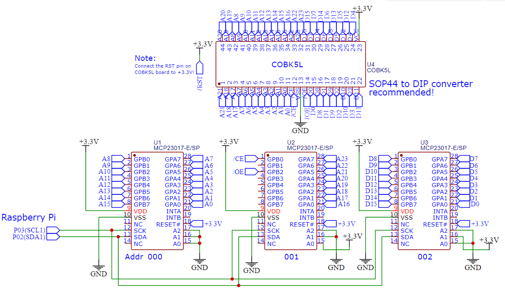

## ROM dumper for K5L2731CAM breakout boards on Famiclone handhelds

This is a prototype of the ROM dumper using 3 I/O expanders (MCP23017) and a Raspberry Pi (any models will do). The dumping process will take about a day or so due to the longer delay times in the Python libraries:

The SOP44 to DIP converter:

Note: If you cannot fit the extracted breakout board, try slowly filing the four corners and retry fitting.

As a default, it is saved as "romdump.hex". The dumped binaries can be run in EmuVT 1.36.
